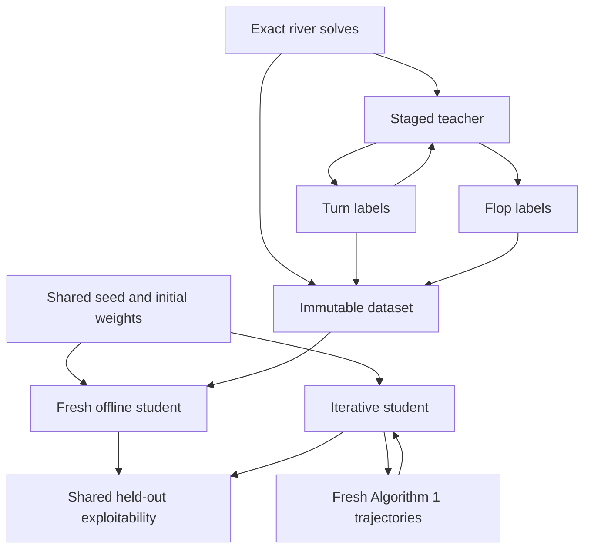

# Requirements

### Goal
Support a reproducible comparison between:

- **Fixed offline training:** build an immutable layered dataset using exact river solves, then staged teacher-backed turn and flop solves; train a fresh student only from that artifact.
- **Iterative ReBeL training:** generate fresh flop-rooted Algorithm 1 trajectories with the current student throughout training.

The comparison tests whether reusable approximate supervision is practically competitive; it will not describe turn/flop labels as exact.

### Functional Requirements
- Use a shared runner so both regimes receive identical initial student weights, optimizer settings, random-seed policy, labeled-example budget, gradient-update budget, and held-out evaluation situations.
- Build the offline artifact in dependency order: exact river data → train temporary teacher → turn data → update teacher → flop data.
- Persist source-separated, sharded arrays plus a manifest containing schema version, counts, configurations, seeds, and teacher-stage provenance so the dataset can be reused without relabeling.
- Ensure the fixed student performs no generation or relabeling; iterative training must generate new labels from the current network each iteration.
- Evaluate both value-network-backed continual-resolving agents with the same per-street held-out exploitability suite and report per-street/aggregate scores, label counts, optimizer updates, and timing. Offline teacher preparation time remains visible separately.
- Keep existing `train_curriculum()` and randomized ReBeL entry points compatible.

### Scope Boundaries
- The comparison concerns the value network used by `ContinualResolver`; fixed policy-network supervision is excluded because the layered `Examples` contract has no policy targets and current exploitability evaluation does not consume `policy_net`.
- Exact arbitrary flop/turn labels and a production-scale 10M-example run are not promised.
- The system provides the experiment and measurements; it does not assume either regime will win.

# Technical Design

### Current Implementation
- `holdem/generation.py` creates exact batched river `Examples`.
- `holdem/bootstrap.py` creates network-dependent turn/flop `Examples` through depth-limited solves.
- `holdem/curriculum.py` generates and immediately trains stage by stage in memory; generation and student fitting are not separable or persistent.
- `holdem/training.py` performs randomized online ReBeL training and already provides `make_test_situations()` and `exploitability_on()`.
- `holdem/rebel.py::collect_trajectory()` implements flop-through-river Algorithm 1 sampling, while `holdem/sampling.py` provides street-aware situations.

### Key Decisions
- **Shared runner:** add `holdem/experiment.py` to own common initialization, budgets, histories, and evaluation while delegating data scheduling to offline and iterative paths.
- **Fresh offline student:** the staged teacher exists only to label the artifact. After generation, restore the same initial state used by the iterative student before fitting the fixed model.
- **Immutable scalable artifact:** add `holdem/dataset.py` around the existing `Examples` arrays. Store source-specific `.npy` shards and a JSON manifest; load shards read-only/memory-mapped and sample across them without concatenating the full dataset. Store masks compactly while returning current float arrays to trainers.
- **Fairness by explicit budgets:** configure and record labeled examples and student updates separately. Teacher preprocessing is additional offline cost and is reported rather than counted as student training.

### Proposed Contracts
```python
@dataclass
class DatasetManifest:
    schema_version: int
    sources: dict[str, int]
    generation: dict
    seeds: dict[str, int]
    teacher_stages: list[dict]

class DatasetStore:
    @classmethod
    def create(cls, path, manifest) -> "DatasetStore": ...
    @classmethod
    def open(cls, path) -> "DatasetStore": ...
    def append(self, source: str, examples: Examples) -> None: ...
    def sample(self, batch_size: int, rng, source_weights=None): ...

@dataclass
class ComparisonConfig:
    dataset_path: str
    offline: OfflineConfig
    iterative: RandomisedReBeLConfig
    evaluation: EvaluationConfig
    seed: int = 0

def run_comparison(config: ComparisonConfig) -> ComparisonResult: ...
```

`holdem/curriculum.py` will expose reusable teacher-stage generation/fitting helpers while retaining `train_curriculum()` as a wrapper. `holdem/training.py` will expose iterative fitting that accepts an initial state and prebuilt test suite instead of creating both internally.

### Data and Evaluation Flow


### Evaluation and Leakage Controls
- Generalize the fixed test-suite builder in `holdem/training.py` to create configured flop, turn, and river situations once and pass the same objects to both runs.
- Extend board exclusion in `holdem/sampling.py` so held-out public boards are rejected across generated descendant boards, avoiding leakage from a held-out flop/turn into longer offline boards.
- Reuse `exploitability_on()` and `ContinualResolver`; allow constrained flop evaluation settings because exact full-tree best response can be expensive.

### Risks
- Flop exploitability may be prohibitively expensive with unrestricted trees; expose per-street counts/betting limits and keep deterministic turn/river scores available.
- Large artifacts consume substantial storage; sharding and memory mapping avoid RAM duplication but do not eliminate target-array size.
- Offline teacher quality strongly affects fixed labels; manifest provenance makes that dependency measurable and prevents accidental comparison with unknown labels.

# Testing

### Validation Approach
Use small deterministic configurations for automated tests and retain existing Hold’em/ReBeL suites as regression coverage.

### Key Scenarios
- Dataset shards round-trip with unchanged features, compact masks, targets, source counts, and manifest provenance.
- Reopening an artifact and training the fixed student performs no label generation and does not mutate the files.
- Staged generation calls exact river, then teacher-backed turn, then teacher-backed flop generation in order.
- Fixed and iterative students begin with byte-identical parameters and use equal configured student update/label budgets.
- Iterative cycles collect fresh flop-rooted trajectories from the current network rather than reusing fixed targets.
- Both results contain finite, comparable per-street and aggregate held-out exploitability metrics from the same test objects.

### Edge Cases
- Reject incomplete/incompatible manifests, unknown sources, empty artifacts, invalid source weights, and mismatched array shapes.
- Verify held-out flop/turn boards are excluded from matching longer generated boards.
- Preserve current `train_curriculum()`, `holdem.training.train()`, and trajectory behavior through existing tests.

# Delivery Steps

### ✓ Step 1: Create the reusable layered dataset artifact
Exact river and staged teacher-backed turn/flop examples can be persisted and sampled as one immutable, provenance-rich dataset.

- Add sharded manifest/store types in `holdem/dataset.py` using the existing `holdem.generation.Examples` contract.
- Separate reusable generation and teacher-fitting helpers from `holdem/curriculum.py` without breaking `train_curriculum()`.
- Build stages in river → turn → flop order and record configurations, seeds, counts, and teacher provenance.
- Add artifact round-trip, validation, immutability, and stage-order tests in `tests/test_holdem.py`.

### ✓ Step 2: Expose matched offline and iterative student trainers
A fixed-data student and an online ReBeL student can train from the same initial parameters under explicit comparable budgets.

- Refactor value-network optimization shared by `holdem/curriculum.py` and `holdem/training.py` into reusable fitting logic.
- Add fixed artifact sampling with no generation during student fitting.
- Adapt randomized ReBeL training to accept supplied initial weights, test situations, and budgets while continuing to refresh Algorithm 1 trajectories from the current net.
- Keep legacy public training functions as compatibility wrappers and test equal initialization/update accounting plus online refresh behavior.

### * Step 3: Add the shared comparison runner and postflop evaluation
One call runs both regimes and returns directly comparable agent-strength histories and cost accounting.

- Add comparison configuration/result models and `run_comparison()` in `holdem/experiment.py`.
- Build held-out flop, turn, and river situations once, exclude them from both data paths, and evaluate both models through the existing continual resolver/best-response machinery.
- Strengthen cross-street held-out board exclusion in `holdem/sampling.py` and provide bounded flop evaluation controls.
- Record per-street/aggregate exploitability, label/update counts, student time, and offline teacher-preparation time.
- Add a tiny deterministic end-to-end comparison test and run the existing Hold’em and ReBeL regression suites.