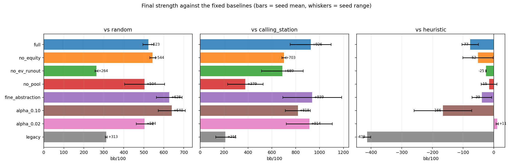
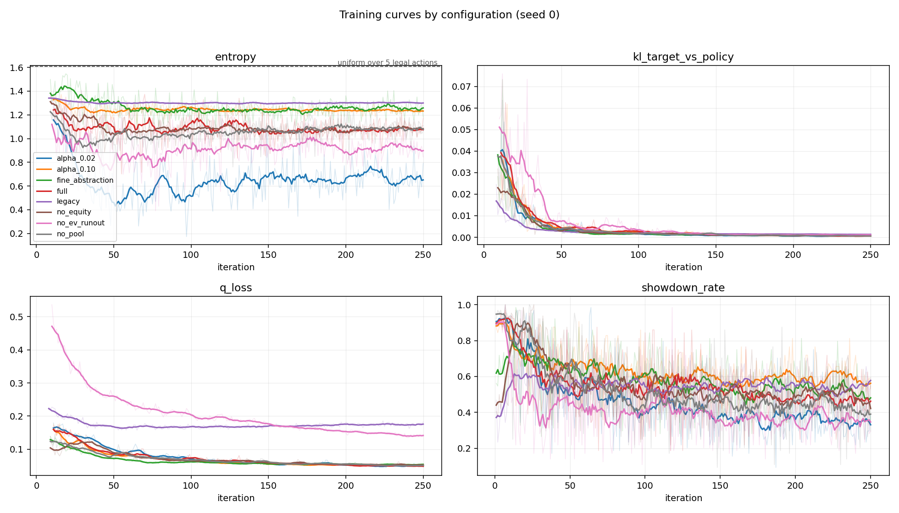
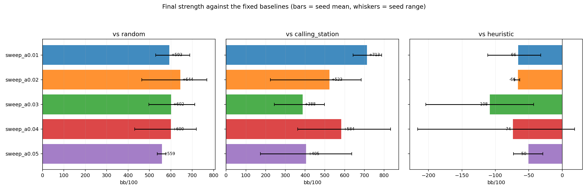
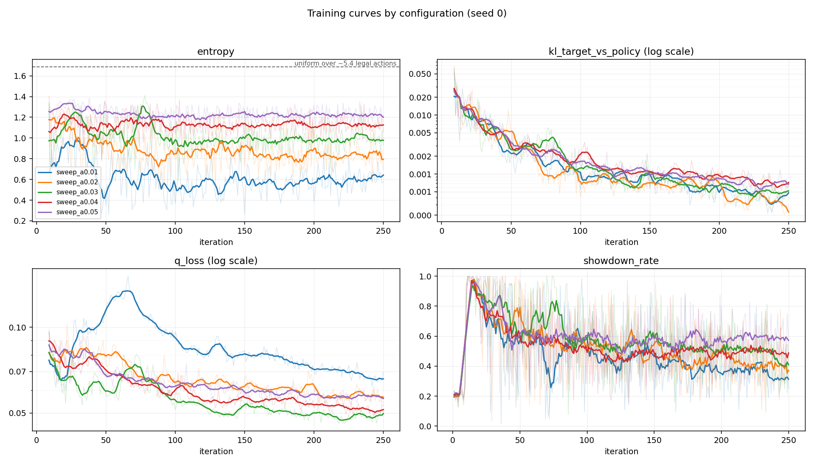

# Three-Player Poker Self-Play

A KLENT-inspired reinforcement learning system for 3-handed No-Limit Texas
Hold'em. One shared ResNet-style network plays every seat, trained purely by
self-play against itself.

No MCTS. No Transformer. No language model. No opponent-specific networks.

```
canonicalised observation
        |
   feature-group encoders (cards / board / players / pot+history / position)
        |
   concat -> Linear(128) -> 6 residual MLP blocks
        |
        +-- policy head -> pi(a|s)
        +-- Q head      -> Q(s,a)
```

---

## Quickstart

```bash
python train.py                      # self-play training with defaults
python evaluate.py --checkpoint checkpoints/latest.pt --hands 3000
python infer.py --checkpoint checkpoints/latest.pt   # or no checkpoint for a random net
python -m pytest tests/ -q           # 166 tests
```

The default objective is stack-normalized chip return with a scaled-tanh
critic. The two alternatives worth running are a linear critic on the same
objective, and the conventional BB-denominated objective:

```bash
python train.py --reward-mode normalized_chip_return                 # A (default)
python train.py --reward-mode normalized_chip_return --unbounded-q   # B, linear critic
python train.py --reward-mode bb_normalized                          # C, BB units
```

Requires PyTorch and NumPy. Nothing else.

`train.py`, `evaluate.py` and `infer.py --show-spec` all print the exact
observation layout and dimensionality at startup.

---

## Design decisions

These are the points the specification left open. Each one is a deliberate
choice, and each is configurable.

### Poker rules

Standard 3-handed No-Limit Hold'em. Button = dealer, SB = dealer+1,
BB = dealer+2. **Three handed, the button acts first preflop** and the small
blind acts first on every later street — a detail that is wrong in many toy
implementations.

Fully implemented: minimum raises, the betting-reopen rule (an all-in that
raises by less than a full raise does *not* reopen the action for players who
already matched the last full-raise level), multi-way side pots, uncalled-bet
returns, split pots, and odd chips going to the first winner clockwise from the
button.

### Reward: stack-normalized chip return (default)

**Money is the reward.** For seat *i*:

```
r_i = net_chip_delta_i / stack_before_hand_i
```

Normalising by *that seat's own stack at the start of the hand* — stored per
seat at reset, not read from a global constant — makes the reward a
risk-adjusted return: the same 100-chip win is worth more to a short stack than
to a deep one, which is the correct scaling when stacks are uneven.

Rewards are **terminal-only**. There is no shaping for winning pots, betting,
surviving streets or reaching showdown; that would invite the agent to farm the
reward function instead of learning profitable play.

| mode | reward | Q head |
|---|---|---|
| `normalized_chip_return` *(default)* | `Δchips / stack_before_hand` | `2·tanh` |
| `bb_normalized` | `Δchips / big_blind` | linear |
| `chip_return` | `Δchips` | linear |
| `binary` | `sign(Δchips)` | `tanh` |

One consequence worth stating for every mode: **a player who folds the button
preflop, having invested nothing, scores 0.** They risked nothing and lost
nothing, so a correct fold is never punished.

`binary` is retained for comparison only. It maximises win *rate* rather than
chip EV and the resulting policy learns to almost never fold — measured under
[Results](#results-reward-design).

### Clipping, and why not at ±1

The reward is clipped symmetrically as a guard against rule or side-pot bugs.
The limit defaults to the **tightest bound the rules actually allow**, which
three-handed is `num_players - 1 = 2`, not 1:

> A seat can lose at most its own stack (−1), but can win *every* opponent's
> at-risk chips (+2). The bound is asymmetric because the game is.

Clipping at ±1 is actively harmful here, and it is measurable. Over 12,000
random-play seat outcomes:

* **48% of all winning outcomes exceed +1** and would be truncated;
* no loss ever falls below −1, so clipping only ever removes upside;
* the mean reward moves from **exactly 0.0 to −0.057**.

That last number is the problem: clipping at ±1 turns a zero-sum game into a
negative-sum one. Every seat then has a systematic incentive not to play — a
fold bias that is precisely the mirror image of the binary reward's never-fold
bias. `tests/test_environment.py` pins both behaviours.

Set `reward_clip` explicitly to override, or `0` to disable clipping entirely.

### Bounded Q head, scaled to the return range

A tanh Q head is only coherent if the *return target* stays inside the squashed
range. Rewards are terminal-only, so the return is bounded by the reward and
the question reduces to whether the reward is bounded.

When it is, the head is `scale · tanh(·)` with `scale` set to the reward bound —
**2.0** for three-handed normalized chip returns. A plain `tanh` capped at 1
would make the largest legitimate wins literally unrepresentable by the critic.
Unbounded modes (`bb_normalized`, `chip_return`) get a linear head
automatically. `--unbounded-q` forces a linear head regardless, which is
experiment B below.

### Objective vs. metric

What the network optimises and how its poker strength is measured are kept
separate on purpose. Training uses the configured `reward_mode`; evaluation
always reports **bb/100** computed from raw chip deltas, independent of the
reward mode. A model can improve its normalised reward without improving the
metric you actually care about, and that has to be visible.

### Folding when you can check

The specification's §5 example lists FOLD as legal with no bet outstanding.
It *is* legal in casino poker, but it is strictly dominated by checking and
only injects noise into self-play. Default: **disabled**. Set
`EnvConfig.allow_fold_when_check_available = True` to follow the specification
literally.

### Action abstraction

Fixed 10-action space; the environment masks what is illegal.

```
0 FOLD   1 CHECK   2 CALL
3 BET_SMALL (0.33x pot)   4 BET_MEDIUM (0.66x pot)   5 BET_LARGE (1.00x pot)
6 RAISE_SMALL (2x bet)    7 RAISE_MEDIUM (3x bet)    8 RAISE_LARGE (4x bet)
9 ALL_IN
```

Two rules keep the abstraction collision-free, so every legal action is a
distinct chip amount:

* a bet/raise bucket that would meet or exceed the stack is masked out —
  `ALL_IN` covers it;
* when the stack is at or below the call amount, `ALL_IN` is masked out —
  `CALL` already means "call for what I have";
* buckets clamped by the minimum raise into the same amount are de-duplicated.

The sizing family is chosen by whether a bet *exists*, not by whether the actor
*faces* one, so the big blind's preflop option is correctly a raise.

### Three-player perspective

Observations are canonicalised to relative seats:

```
0 = SELF   1 = OPPONENT_LEFT   2 = OPPONENT_RIGHT
```

`OPPONENT_LEFT` is the next seat clockwise. Villain-left acting therefore sees
`SELF = villain_left, LEFT = villain_right, RIGHT = hero`. The network receives
no absolute seat identity; position that genuinely matters is supplied
explicitly as distance from the button (dealer / SB / BB one-hot).

### Terminal rewards and per-seat returns

This is the part most likely to be silently wrong, so it is worth spelling out.

A transition belongs to the seat that acted, and **that seat's "next state" is
its own next decision point** — not the state that immediately follows, which
usually belongs to a different player. Self-play therefore builds one decision
chain per seat and runs the λ-return recursion along each chain independently:

```
G_t = gamma * [ (1 - lam) * V(s_{t+1}) + lam * G_{t+1} ]      (t < T)
G_T = terminal reward for that seat
```

A seat that folds on the flop terminates its chain there — its outcome is
already determined — while the other seats keep acting. Every transition
stores its `player_perspective`, and `tests/test_self_play.py` asserts that
with `gamma = lam = 1` every target equals *that seat's* own outcome, which is
the test that catches training all three seats from hero's point of view.

### Observation dimensionality

**982 features** with the default config. Printed at startup by every entry
point:

| group | dim | contents |
|---|---|---|
| `cards` | 146 | own hole cards (2x18), masked opponent slots (72), derived features (38) |
| `board` | 94 | five board slots (5x18), street one-hot (4) |
| `players` | 42 | 3 x 14 per-player features, ordered SELF / LEFT / RIGHT |
| `pot_history` | 694 | pot features (12), action history (32x21), legal mask (10) |
| `position` | 6 | position relative to the button |

Every card is rank one-hot (13) + suit one-hot (4) + present mask (1). Unknown
cards are zero-filled and masked. Monetary values are normalised by the big
blind and by the effective stack, with epsilon-guarded division.

The 72 opponent-card features exist and are **always zero** during play. They
are kept so the leakage test has an explicit region to assert on;
`ObsConfig.include_opponent_card_slots = False` removes them.

### Equity feature

Disabled by default, per the specification. When enabled
(`ObsConfig.use_equity_feature`), equity is estimated by Monte-Carlo rollout
sampling opponent holdings from *the full deck minus the acting player's own
cards and the board* — never from the cards actually dealt. The leakage test
covers this path specifically.

---

## Information leakage

Priority #2 in the specification, and tested by construction rather than by
inspecting feature indices. `tests/test_information_leakage.py` mutates the
hidden world and requires the encoded observation to come out bit-for-bit
identical:

* replace both opponents' hole cards with different cards -> identical tensor;
* reorder the undealt deck, changing every future board card -> identical
  tensor;
* two hands where hero's aces win versus lose -> identical tensor at the same
  decision point.

Any leak, however indirect, breaks that equality.

---

## Policy improvement

The KL/entropy-regularised improvement operator:

```
pi_new(a|s)  proportional to  exp( (Q(s,a) + beta * log pi_ref(a|s)) / (alpha + beta) )
```

restricted to legal actions and renormalised over them. Equivalently:

```
pi_new  proportional to  pi_ref^(beta/(alpha+beta)) * exp(Q/(alpha+beta))
```

* smaller `alpha + beta` -> greedier step;
* larger `beta/alpha` -> stays closer to the reference policy;
* `alpha, beta -> 0` -> greedy `argmax Q`.

Defaults are `alpha = beta = 0.5`. With binary rewards Q lives in `[-1, 1]`, so
`alpha + beta = 1` spreads the best and worst action by up to ~7x while still
regularising. (`alpha = beta = 1.0` is a valid but very conservative choice —
it moves the policy so little that learning is slow.)

The reference policy defaults to the **current network's policy, detached** —
i.e. the policy immediately before the update. `reference_policy = "behavior"`
anchors to the behaviour policy stored with each transition instead, which is a
truer trust region but grows stale as the buffer ages.

The mask is applied *before* normalisation everywhere, so an illegal action can
never receive probability mass.

## Losses

```
L_total = q_weight * L_Q + policy_weight * L_policy + entropy_weight * L_entropy
```

* `L_Q` — Huber regression of `Q(s, a_taken)` onto the λ-return target. Only
  the taken action is trained; counterfactual targets are not available
  model-free.
* `L_policy` — cross-entropy of the current policy against the improved policy,
  over legal actions only.
* `L_entropy` — *negative* mean entropy, so a positive coefficient rewards
  exploration.

Defaults: `1.0 / 1.0 / 0.01`, all configurable.

---

## Layout

```
environment/     rules: cards, hand evaluation, betting, state, the env itself
representation/  canonicalisation, observation encoding, action encoding
model/           residual blocks, heads, the shared network
training/        self-play, replay buffer, returns, policy improvement, trainer
evaluation/      baseline agents and the match-play harness
inference/       the public suggest_action API
tests/           149 tests
config.py        every tunable, serialised into checkpoints
train.py  evaluate.py  infer.py
```

The `Agent` interface and `NetworkAgent` live in `training/self_play.py` so the
dependency graph stays acyclic (`evaluation` imports `training`, never the
reverse).

Checkpoints carry their full `Config`, so a trained network can never be loaded
against an observation layout it was not trained on — `load_checkpoint` checks
and refuses.

---

## Inference API

```python
from inference.suggest_action import SuggestionEngine

engine = SuggestionEngine.from_checkpoint("checkpoints/latest.pt")
engine.suggest(table_state, temperature=1.0, mode="argmax")
```

```json
{
  "action": "CHECK",
  "probabilities": {"FOLD": 0.0, "CHECK": 0.63, "...": "..."},
  "q_values": {"FOLD": null, "CHECK": 0.18, "...": "..."},
  "legal_actions": ["CHECK", "BET_SMALL", "BET_MEDIUM", "BET_LARGE", "ALL_IN"],
  "acting_player": "hero",
  "bet_to": 60,
  "chips_to_put_in": 60,
  "state_value": 0.18
}
```

Probabilities sum to 1 over legal actions; illegal actions report probability
`0.0` and a `null` Q-value. `mode` is `argmax` or `sample`; `temperature = 0`
collapses onto the best action.

Three things the raw table-state format does not carry, and how they are
handled:

* **whose turn it is** — defaults to `hero`; pass `"to_act"` to override;
* **action history** — absent, so the history block is zero-padded and masked.
  A suggestion from a bare snapshot is weaker than one made inside a live hand;
  pass `"action_history"` to fill it in;
* **who contributed what on earlier streets** — only the total pot is given, so
  the dead portion is split evenly between live players. This affects
  normalised features only, never legality.

Malformed states raise `TableStateError` — duplicate cards, a board that does
not match the street, a pot smaller than the posted bets, an acting player with
no hole cards, and so on.

---

## Evaluation

Three-handed poker is not zero-sum between any *pair* of players, and the
button has a real edge, so a single seat assignment is not a fair comparison.
Every matchup is played in **all three seat rotations** and reported both per
seat and per agent.

Baselines: random (uniform over legal actions), calling station, always-fold,
and an equity-versus-pot-odds heuristic bot that reads only its own cards and
the public board. Also supported: current network vs. an older checkpoint, and
the self-play population against itself.

Tracked per seat and per agent: win / loss / tie rate, average reward, average
chip return, and bb/100.

A useful sanity check that falls out of this: three copies of the same agent
must show a win rate near 1/3 and average chips of exactly 0.

### bb/100 is extremely noisy, and independent hands are not enough

With 50bb stacks the same checkpoint measured −500 bb/100 against a calling
station at 300 hands and +69 bb/100 at 3000. Even at **900 hands the 95%
interval is ±230 to ±350 bb/100** — wider than most effects worth detecting.
Any comparison reported without an interval is likely to be noise.

Two variance reductions are built in, both in `evaluation/evaluate.py`:

* **Duplicate deals** (`duplicate_deal_scores`). Each deal is replayed three
  times from the *same* deck order with the hero rotated through every seat,
  and the three results averaged. This cancels most of the "who was dealt
  aces" term and roughly halves the interval at equal hand count.
* **Paired comparison** (`compare_agents_paired`). Because the deck order is
  fixed by the deal seed, two agents can be scored on *identical* cards and
  compared deal-by-deal, so the interval is computed on the per-deal
  difference rather than on two independent samples.

`bb_per_100_interval` reports the mean with a 95% interval and a
`significant` flag. Use it.

---

## Results: reward design

### Binary reward optimises the wrong objective

Two 250-iteration runs (~16k self-play hands each, identical apart from
`reward_mode`), evaluated over 3000 hands with seat rotation. "chip-return"
here is the earlier `Δchips / starting_stack` variant:

| matchup | bb/100 | win rate |
|---|---:|---:|
| binary vs 2x calling station | +69 | 29.1% |
| **chip-return** vs 2x calling station | **+209** | 25.5% |
| binary vs 2x random | +424 | 48.6% |
| chip-return vs 2x random | +301 | 30.5% |
| **chip-return vs 2x binary** | **+87** | 19.2% |
| binary vs 2x chip-return | −126 | 48.7% |

The head-to-head agrees in both directions: the chip-return network beats the
binary network. And the inversion is the whole story — **the binary network
wins 48.7% of hands against the chip-return network while losing 126 bb/100.**

The mechanism is visible in the policies. Playing greedily, the binary network
reaches showdown in **100%** of self-play hands; the chip-return network in
45%. Sampling at temperature 1, they fold 18.5% and 27.7% of the time
respectively when folding is legal.

This is not a bug — it is what the objective says. Under `sign(net chips)`,
once you have posted a blind, folding locks in −1 while calling preserves a
chance of +1, *no matter how much money the call costs*. The binary reward
cannot see the difference between losing 1 chip and losing 500, so the optimal
binary policy is to essentially never fold. It genuinely maximises win rate;
win rate is just not what wins money at poker.

`binary` is therefore no longer the default. It is retained for comparison and
as a clean, bounded, easily-learned signal, but it is not a poker objective.

### alpha and beta silently carried units

Discovered while running experiment C below. The improvement operator computes
`exp(Q / (alpha + beta))`, so the *reward scale* changes what `alpha` and
`beta` mean. Under `bb_normalized` the reward reaches ±50, and the operator
exponentiates ±50:

| \|Q\| | best/worst probability ratio at `alpha + beta = 1` |
|---:|---:|
| 0.3 | 1.8x |
| 1.0 | 7.4x |
| 50.0 | 2.7e43 |

The policy collapsed to deterministic on the first update — entropy 0.13,
3.0 decisions per hand (everyone folding immediately), showdown rate 0.00. The
Q loss compounded it: Huber with `delta = 1` on targets of ±50 is effectively
linear, so the Q term outweighed the policy term ~50x.

Both are fixed by normalising Q by the reward scale — inside the operator, and
on both sides of the Huber loss. `alpha`, `beta`, `huber_delta`, `q_weight` and
`policy_weight` now mean the same thing in every reward mode. The effect on
the same `bb_normalized` configuration:

| | q_loss | entropy | decisions/hand | showdown |
|---|---:|---:|---:|---:|
| unnormalised operator | 16.4 | 0.13 | 3.0 | 0.00 |
| scale-corrected | 0.30 | 1.40 | 5.1 | 0.55 |

This is invisible under `binary` and `normalized_chip_return`, where the scale
is 1.0 and the correction is a mathematical no-op. It only bites when the
reward magnitude changes — which is exactly what happens when you switch
objectives.

### Experiment matrix

Three runs of **1000 iterations (~64k self-play hands each)**, same seed,
differing only in objective and Q head. Scored on **1200 duplicate deals
(3600 hands) per cell**, identical cards for every agent, under one common rule
set. `*` = 95% interval excludes zero.

| | objective | Q head | vs random | vs calling station |
|---|---|---|---:|---:|
| **A** | `normalized_chip_return` | `2·tanh` | +356 ±106 * | +200 ±101 * |
| **B** | `normalized_chip_return` | linear | +399 ±104 * | +190 ±94 * |
| **C** | `bb_normalized` | linear | +324 ±101 * | +49 ±107 |

Paired differences on identical deals, and head-to-head:

| paired difference | vs random | vs station | | head to head | bb/100 |
|---|---:|---:|---|---|---:|
| A − B | −43 ±125 | +10 ±121 | | A vs 2x B | −2 ±87 |
| A − C | +32 ±117 | **+151 ±135 \*** | | B vs 2x A | +6 ±89 |
| B − C | +75 ±122 | **+141 ±126 \*** | | C vs 2x A | **+147 ±84 \*** |

All three also lose to the equity-based heuristic bot, which remains the
strongest player in the pool (700 duplicate deals = 2100 hands per cell):

| | vs tight-aggressive | vs loose-passive |
|---|---:|---:|
| **A** | −214 ±98 * | −253 ±114 * |
| **B** | −395 ±99 * | −481 ±108 * |
| **C** | −149 ±90 * | −334 ±120 * |

| paired difference | vs tight-aggressive | vs loose-passive |
|---|---:|---:|
| **A − B** | **+181 ±108 \*** | **+229 ±141 \*** |
| A − C | −65 ±110 | +81 ±147 |
| B − C | −246 ±108 * | −147 ±148 |

### What experiment B actually answers

The bounded Q head **does** help — but the effect is only visible against an
opponent strong enough to punish bad play:

| opponent | A − B | significant? |
|---|---:|---|
| random | −43 ±125 | no |
| calling station | +10 ±121 | no |
| head-to-head | −2 ±87 | no |
| tight-aggressive heuristic | **+181 ±108** | **yes** |
| loose-passive heuristic | **+229 ±141** | **yes** |

Against random and calling-station opponents A and B are indistinguishable;
against both heuristic variants A beats B by ~180–230 bb/100 with intervals
that exclude zero. So the answer to "is the tanh unnecessarily restrictive?" is
**no — the scaled-tanh critic is better**, and the reason the difference
vanishes against the weak baselines is that a bot which never folds and never
raises cannot exploit a worse-calibrated critic. The baseline has to be strong
enough for the difference to have somewhere to show up.

The ranking against the heuristics is **A ≈ C > B**, while against the calling
station it was **A ≈ B > C**. Three-player poker is not transitive, and neither
is "strength" here: which agent looks best depends on the opponent pool. If you
have to pick one number to optimise, pick results against the strongest
available opponent.

### Why it loses to the heuristic: alpha caps the policy

Diagnosing the trained default agent at real decision points against the
heuristic:

| measurement | value | reading |
|---|---:|---|
| Q spread over legal actions | 0.458 | the **critic has learned** — it separates actions |
| policy entropy | 1.581 | uniform over 5 actions is 1.609: the **policy is ~random** |
| KL(improved ‖ current) | 0.0005 | the improvement step moves almost nothing |
| greedy action mix | ALL_IN **26%** | it jams a quarter of the time |
| avg won / avg lost | 226 / 382 chips | wins small, loses big — at a 50% win rate |

The cause is algebraic, not a bug. The improvement operator is

```
pi_new  ∝  pi_ref^(β/(α+β)) · exp(Q/(α+β))
```

and its **fixed point** (where `pi = improve(pi)`) solves
`pi^(α/(α+β)) ∝ exp(Q/(α+β))`, i.e.

```
pi*  ∝  exp(Q / alpha)          ← beta cancels entirely
```

**β controls how fast you approach the fixed point; α alone decides how sharp
that fixed point is.** With the measured Q spread of 0.458:

| alpha | best/worst probability ratio | entropy at the fixed point |
|---:|---:|---:|
| 0.5 (old default) | 2.5 | 1.559 |
| 0.2 | 9.9 | 1.339 |
| 0.1 | 97 | 0.895 |
| 0.05 | 9509 | 0.365 |
| *uniform* | 1.0 | 1.609 |

Measured entropy was **1.581** against a predicted **1.559** — the policy had
converged, and the fixed point itself was nearly uniform. At α = 0.5 the agent
*cannot* play sharply no matter how good its critic gets, and near-uniform play
over this action space means shoving 26% of the time.

This also explains the plateau below: extra hands sharpen the critic, but the
policy is pinned by α, so nothing downstream improves.

### Fixing it: the alpha sweep

Each row is 300 iterations (19k hands), evaluated on 600-700 duplicate deals
against the held-out `tight_aggressive` heuristic. The old default is 1000
iterations (64k hands) for reference:

| config | vs heuristic (bb/100) | entropy | ALL_IN | FOLD |
|---|---:|---:|---:|---:|
| α = 0.5, **1000** iters (old default) | −196 ±106 | 1.57 | 20% | 14% |
| α = 0.20 | −239 ±102 | 1.52 | 32% | 18% |
| α = 0.10 | −171 ±85 | 1.46 | 16% | 25% |
| **α = 0.05** | **−42 ±78** | 1.01 | 5% | 23% |
| α = 0.02 | −244 ±85 | 0.68 | 6% | 8% |
| α = 0.01 | −53 ±67 | 0.43 | 15% | 37% |
| α = 0.10 + opponent pool | −96 ±80 | 1.36 | 17% | 26% |
| α = 0.05 + opponent pool | −62 ±58 | 1.10 | 5% | 26% |

**What is solid:** lowering α from 0.5 is worth roughly **140 bb/100**, and does
it with 3× less training. The best configurations cluster at −40 to −60 and
their intervals cover zero (break-even against the heuristic); the old default
was −196. The mechanism is verified independently of the sweep: predicted
fixed-point entropy 1.559 versus measured 1.581.

**What is not solid:** the exact optimum. The response is *not monotone* —
α = 0.02 collapses to −244 while its neighbours 0.05 and 0.01 both reach ~−50.
A 200-point swing between adjacent settings cannot be explained by the ±80
evaluation intervals.

That is the methodological trap in this table: the intervals measure
*evaluation* noise (card luck), but every row is a **single training seed**, and
seed-to-seed trajectory variance is evidently larger. α = 0.02 folds 8% of the
time and α = 0.01 folds 37% — qualitatively different strategies from adjacent
hyperparameters. Pinning the optimum needs 3-5 seeds per setting compared on
seed means. Until then α ≈ 0.05 is a working default, not a tuned value.

**The two fixes are not additive.** The opponent pool is worth ~75 bb/100 at
α = 0.10 (−171 → −96) but nothing at α = 0.05 (−42 → −62, intervals heavily
overlapping). The plausible reading is that both address the same underlying
defect — a critic calibrated against a bad opponent distribution. Lowering α
fixes it by making self-play itself sharper; the pool fixes it by importing
competent opponents. Do either and the other adds little.

Note the causal chain runs through the *critic*, not just the actor: evaluation
is greedy, so the shove rate falling from 20% to 5% means the critic itself
stopped rating ALL_IN best.

**Still not beating the heuristic.** Break-even is not the goal; see the
roadmap for what is left.

### Training plateaus early

Same runs, evaluated at intermediate checkpoints (900 duplicate deals each):

| iteration | A vs random | A vs station | C vs random | C vs station |
|---:|---:|---:|---:|---:|
| 250 | +342 ±121 | +257 ±113 | +331 ±124 | +201 ±109 |
| 500 | +398 ±123 | +186 ±119 | +434 ±114 | +349 ±127 |
| 750 | +260 ±119 | +304 ±108 | +321 ±122 | +249 ±122 |
| 1000 | +380 ±125 | +204 ±118 | +364 ±117 | +55 ±122 |

Every column is flat within its interval. **Training from 16k to 64k hands
bought no measurable improvement** against fixed baselines. The bottleneck is
not the number of hands, and it is not the critic — the plausible candidates
are network capacity, the coarse bet abstraction, and self-play against a
single shared policy providing limited strategic diversity.

### A correction, twice over

This conclusion was measured three times and moved twice; the history is worth
keeping.

1. **150 iterations, 2500 independent hands, no intervals** — claimed A beats B
   and that the bounded head mattered. Not supported by its own evidence: at
   that sample size the interval against a calling station is roughly ±200
   bb/100, wider than the effect claimed.
2. **1000 iterations, duplicate deals, intervals, weak baselines** — A and B
   indistinguishable everywhere. Read as a null result.
3. **Same runs, heuristic opponents** — A beats B by +181 ±108 and +229 ±141.

The reconciliation is that (2) was measured against opponents too weak to
discriminate, not that the effect was absent. Steps (1) and (3) agree in
direction, but (1) had no right to that conclusion at the time.

Two lessons, both now baked into `evaluation/evaluate.py`: always report an
interval, and **your choice of baseline bounds what you are able to detect.**
A calling station cannot tell a good agent from a mediocre one.

---|---|---|---:|---:|
| **A** | `normalized_chip_return` | `2·tanh` | +193 | **+128** |
| **B** | `normalized_chip_return` | linear | +221 | **+1** |
| **C** | `bb_normalized` | linear | +254 | +99 |

Head to head, one seat against two copies of the other:

| matchup | bb/100 | | matchup | bb/100 |
|---|---:|---|---|---:|
| A vs 2x B | **+121** | | B vs 2x A | −50 |
| C vs 2x B | **+93** | | B vs 2x C | −101 |
| C vs 2x A | +51 | | A vs 2x C | −6 |

**Experiment B answers its own question: the bounded Q head is not limiting
performance.** With the objective held fixed, replacing the scaled tanh with a
linear head made the agent *worse* on every measure — near-breakeven against a
calling station, and losing in both directions of the head-to-head. Four
independent measurements agree. The likely reason is conditioning rather than
capacity: the squash keeps early Q estimates inside the range the returns
actually occupy, and a linear head has to discover that scale from a very noisy
terminal-only signal.

A and C are comparable — the A-vs-C head-to-head is +51 / −6, which is inside
the noise at this sample size. Both are sound choices. A is the default because
its bounded critic is better conditioned; C is the conventional poker
parameterisation and is worth running if you prefer BB units end to end.

Note this only became a fair test after the scaled tanh: a plain `tanh` capped
at 1 cannot represent the +1..+2 band that 16% of outcomes land in, so the
earlier `normalized_chip_return` runs were handicapping their own critic.

---

## Roadmap: implemented

All six items below are implemented and tested. The first two are measured;
the rest are mechanisms whose effect still needs a full training comparison.

### 1. Lower alpha (measured: ~140 bb/100)

`alpha` alone sets how sharp the converged policy can be (`pi* ∝ exp(Q/alpha)`).
At the old default of 0.5 the agent was pinned near-uniform and shoved 20-32% of
the time regardless of how good its critic got. See the sweep above.

### 2. Mixed-opponent and league training (measured: ~75 bb/100 at alpha=0.10)

```
--opponent-pool heuristic,loose_passive,calling_station,checkpoint
--opponent-mix-prob 0.5 --league-recency-decay 0.5
```

Pure self-play calibrates Q against exactly one distribution: its own current
policy. Fixed bots and frozen snapshots occupy 1-2 seats for a fraction of
hands. Transitions are collected **only** from learner seats -- an opponent's
decisions were not drawn from the policy being improved.

**Snapshots are sampled by recency**: the newest gets weight 1, the one before
it `league_recency_decay`, then `decay²`, and so on, so the learner mostly
faces recent (stronger) versions of itself while older ones stay in the mix to
avoid cycling against a single opponent. At the default 0.5 with a league of 4
the shares are 54 / 26 / 13 / 7 percent.

### 3. Equity feature, memoised (now on by default)

`ObsConfig.use_equity_feature = True`. Naively this costs 40x in observation
throughput. It is made affordable by memoising on a **suit-isomorphic** key:
equity is invariant under relabelling suits, so taking the lexicographically
smallest image over all 24 suit permutations collapses 1326 preflop hole
combinations to 169 and merges every board with the same suit pattern. Measured
~70% cache hit rate and a 5.4x speedup over the uncached version.

### 4. All-in EV runouts (measured: reward std 0.79 -> 0.40)

`EnvConfig.all_in_ev_runout = True`. When betting is closed, the pot is settled
on the **expected split over every remaining board** rather than one random
runout -- enumerated exactly when there are few completions, sampled otherwise.
Identical in expectation (mean reward stays 0.0, chips conserve to 1e-13) at
**half the standard deviation**, which is worth as much as quadrupling the
number of hands. A concrete board is still dealt so observations and history
stay meaningful; only the chips are settled on the expectation. Preset boards
always take the concrete path so scripted hands stay reproducible.

### 5. Configurable bet abstraction

The action space is still *fixed* for a given configuration -- the network needs
a constant output width -- but its **size is derived** from `bet_fractions` and
`raise_multipliers`:

```
0 FOLD, 1 CHECK, 2 CALL, <bet sizings>, <raise sizings>, ALL_IN last
```

The default three-and-three reproduces the documented ten-action space exactly,
ids and names included. A finer setting widens the mask, every action-history
slot, and the network heads automatically:

| sizings | actions | observation dim |
|---|---:|---:|
| 3 bets, 3 raises (default) | 10 | 984 |
| 5 bets, 5 raises | 14 | 1116 |
| 8 bets, 6 raises | 18 | 1248 |

Names stay `BET_SMALL/MEDIUM/LARGE` for the classic three and become
size-derived (`BET_25`, `RAISE_2_5X`) otherwise. The heuristic bot expresses its
preferences as "largest available raise" rather than fixed ids, so it keeps
working in any space.

### 6. Batched self-play (measured: 2.3x)

`--self-play-envs 64` advances that many hands in lockstep so their decisions
batch into a single forward pass. Semantics are identical -- at temperature 0
the batched and sequential workers agree transition for transition on the same
deal, which is asserted in the tests.

The speedup is **2.3x, not the 10-50x estimated earlier**: batching removes the
per-decision forward pass, which shifts the bottleneck onto Python-side
observation construction. Getting further means vectorising the encoder, not
larger batches.

### What does *not* help

* **More hands at fixed hyperparameters.** Measured flat from 16k to 64k hands.
* **Reward shaping** for pot size, aggression, or reaching showdown.

---

## Benchmark

`benchmark.py` trains a matrix of configurations and scores each against the
three fixed baselines. It is an **ablation from one reference configuration**
rather than a grid, so every difference is attributable to a single change.

```bash
python benchmark.py train    --config full --seed 0 --root runs/   # per cell
python benchmark.py evaluate --config full --seed 0 --root runs/
python benchmark.py report   --root runs/ --out runs/report        # tables + plots
python benchmark.py replot   --report runs/report                  # redraw figures
```

`report` writes `<prefix>_histories.json` alongside the tables, holding every
cell's per-iteration metrics for every seed. `replot` redraws both figures from
that file and `<prefix>.json` alone, so the plots can be restyled after the run
directories — which are large, and hold the checkpoints — have been deleted.
Without it, restyling a curve means re-training the cell.

Results below: 8 configurations x 2 seeds, 250 iterations (16k hands) each,
scored on 600 duplicate deals (1800 hands) per cell.

| config | vs random | vs calling station | vs heuristic |
|---|---:|---:|---:|
| `full` (α=0.05, equity, EV, pool) | +523 | +926 | −77 |
| `no_equity` | +544 | +703 | −52 |
| `no_ev_runout` | +264 | +689 | −25 |
| `no_pool` | +504 | +379 | −15 |
| `fine_abstraction` (5×5 sizings) | +628 | +939 | −39 |
| `alpha_0.10` | +640 | +818 | −166 |
| **`alpha_0.02`** | +504 | +914 | **+11** |
| `legacy` (the original config) | +313 | +211 | **−413** |



### The noise floor

Seed-to-seed spread over just two seeds reaches **490 bb/100** against the
calling station, ~200 against random and ~190 against the heuristic. Any
difference smaller than that is not a result. The evaluation intervals
(±40-90) are much tighter than the seed spread, which is exactly why the plot
shows the **seed range** as whiskers rather than the evaluation interval.

### What survives that filter

* **The overall improvement is large and unambiguous.** Against the heuristic,
  `legacy` −413 → roughly break-even. Against the calling station, +211 → +900.
  Against random, +313 → +500-640.
* **All-in EV runouts are the clearest single win.** Removing them costs
  −259 bb/100 against random with a seed spread of only ~16-53, the tightest
  measurement in the table. The training curves show why directly: `q_loss`
  sits ~3x higher without them.
* **Lower alpha keeps helping against the strongest opponent**: −166 (α=0.10)
  → −77 (α=0.05) → +11 (α=0.02). Note α=0.02 was *unstable* in the earlier
  sweep and is now the best cell — the instability was caused by the noisy Q
  signal that EV runouts removed. The two changes interact.
* **`alpha_0.02` is the first configuration that is not losing to the
  heuristic** (+11, interval covering zero).

### What does not survive it

* **Equity is not demonstrated.** +22 against random (noise), and it costs
  3-4x self-play throughput. On this evidence I would leave it off.
* **The finer abstraction is promising but unproven**: +105/+13/+38, all inside
  the seed noise. It is never worse, which is mildly encouraging.

### A contamination caveat, and it matters

The opponent pool contains `calling_station`, `heuristic` and `loose_passive`
— and two of those are also *evaluation baselines*. For any pool-using
configuration the "vs calling station" and "vs heuristic" columns are partly
**training on the test opponent**.

The evidence that this matters: dropping the pool costs 548 bb/100 against the
calling station but only **18 against random** — and random is the one baseline
*not* in the pool. So the pool's apparent benefit is largely contamination, and
`vs random` is the only clean generalisation measure in the table.

Fixing this properly means holding a family of opponents out of training
entirely. The `--opponent-pool` flag makes that easy; it was not done here.

### Training curves



Reading them:

* **entropy** — `legacy` (purple) sits flat at 1.30 against a uniform bound of
  1.61: the original failure, a policy ignoring its critic. `alpha_0.02` (blue)
  is lowest at ~0.65 and still visibly oscillates.
* **q_loss** — `no_ev_runout` (pink, 0.14-0.47) and `legacy` (purple, ~0.17)
  are several times higher than every EV-runout configuration (~0.05). This is
  the variance reduction visible directly in the learning signal.
* **kl_target_vs_policy** — collapses toward zero for every configuration by
  iteration ~150: the policy has reached its fixed point, and after that only a
  better critic (or a smaller alpha) moves it.

---

## Alpha sweep on a clean setup

The first benchmark's pool contained `calling_station` and heuristic-family
bots that were *also* evaluation baselines. This sweep removes them: the pool
is **self-snapshots only**, so all three baselines are genuinely held out.
Equity is off (never demonstrated, 3-4x throughput cost) and the finer 5x5
abstraction is kept. Five alpha values, **3 seeds each**, 250 iterations,
700 duplicate deals (2100 hands) per cell.

| alpha | vs random | vs calling station | vs heuristic |
|---:|---:|---:|---:|
| 0.01 | +593 | +713 | −66 |
| 0.02 | +644 | +523 | −66 |
| 0.03 | +602 | +388 | −108 |
| 0.04 | +600 | +584 | −74 |
| 0.05 | +559 | +405 | −50 |



### Alpha has no detectable effect below 0.05

Within-alpha seed spread reaches **471 bb/100** against the calling station,
305 against random and 235 against the heuristic. The between-alpha variation
(85, 325 and 58 respectively) is *smaller than the noise*. This is a flat
response, not a curve with an optimum.

That is consistent with the mechanism rather than contradicting it. Alpha still
does exactly what the algebra says -- the entropy curves separate cleanly and
monotonically by alpha (0.63, 0.85, 0.98, 1.12, 1.22 at convergence, against a
uniform bound of 1.69). The earlier 0.5 → 0.05 change was worth ~140 bb/100
because it moved the policy off the near-uniform ceiling. Once alpha is small
enough that the policy acts on its critic at all, **making it smaller does not
help further**.

The cost of going too low is visible in the training curves: alpha = 0.01 has
a clearly higher `q_loss` throughout (~0.065 versus ~0.050-0.060), because a
sharper policy explores less and the critic learns less about untaken actions.
That is the exploration/exploitation trade-off appearing directly in the
learning signal.



### The break-even against the heuristic did not reproduce

The earlier benchmark reported `alpha_0.02` at **+11 bb/100** against the
heuristic -- the first configuration not losing to it. On the clean setup the
same alpha gives **−66**, and every alpha in the sweep loses by 50-108.

The difference is exactly the contamination: that cell trained against
`heuristic` and `loose_passive`, from the same family as the evaluation bot.
**The apparent break-even was training on the test opponent, not strength.**

The same correction shows against the calling station: `full` measured +926
with the station in its training pool, while these clean runs measure +388 to
+713 without it.

### Where this leaves the agent

Against genuinely held-out opponents, after 16k hands of self-play:

* **beats random by ~600 bb/100** and **the calling station by ~400-700**, both
  decisively and at every alpha;
* **still loses to the equity-based heuristic by 50-110 bb/100.**

Alpha is no longer the lever. The remaining candidates are the ones the
ablation could not settle: a larger network, materially more hands now that
batching makes them cheaper, and a held-out-opponent league that is broader
than self-snapshots alone.

---

## Comparing runs

Every run writes `history.json` next to its checkpoints. To compare settings:

```bash
python -m training.plotting checkpoints/alpha0.05 checkpoints/alpha0.10 \
    --metrics entropy kl_target_vs_policy q_loss --window 9 --out compare.png
```

Policy **entropy** is the headline panel, and it is informative in both
directions. Entropy near `log(num legal actions)` means the policy is ignoring
its critic; entropy near zero means it has stopped exploring, so the critic
never learns the value of untaken actions, and the strategy is readable.

**Lower entropy is not better.** Across the alpha sweep the correlation between
entropy and result is only -0.47, and the best setting sits at mid-range
entropy 1.01 while the *lowest* entropy run (0.43) is worse. The plot also
shows why: at alpha <= 0.02 entropy oscillates between 0.1 and 0.7 instead of
settling, which is training instability rather than a sharper policy.

---

## Performance and limitations

* ~30 hands/second single-threaded on a laptop CPU. The bottleneck is Python
  observation construction plus one single-sample forward pass per decision,
  not the network. Batching decisions across parallel hands is the obvious
  next optimisation; per the specification's priorities, it was not done
  prematurely.
* Default replay capacity is 100k transitions (~400 MB reserved, observations
  stored as float16). 1M is supported — set `replay_capacity` — at ~4 GB.
* λ-return targets are computed at collection time from the collecting
  network's values, so they age slightly as the buffer turns over. With
  terminal-only rewards and short chains (a few decisions per seat per hand)
  the targets are close to Monte-Carlo returns, so the staleness is mild.
  `next_observation` is stored for every transition and is available if you
  want to recompute bootstraps at training time instead.
* The action abstraction is coarse. Real solvers use far more sizings.
* There is no exploitability computation — only the proxy of results against
  fixed baselines and older checkpoints.
* `binary` reward maximises win rate, not chip EV — see
  [Results](#binary-reward-optimises-the-wrong-objective).  It is not the
  default; it is kept for comparison.
* The reward normalises by *per-hand* starting stack, which optimises expected
  percentage return rather than long-run bankroll.  Because `reset()` restores
  stacks every hand, each hand is an independent episode and the two coincide
  in the default configuration; they diverge if you add persistent stacks.
  Log-utility shaping (`U(C) = log C`) would make the objective explicitly
  risk-averse and is deliberately *not* implemented.
* The trained agent is not a strong poker player. A 390k-parameter network
  beats the random and calling-station baselines comfortably and still loses
  chips to the equity-based heuristic bot. More hands is *not* the fix: results
  are flat from 16k to 64k hands (see
  [Training plateaus early](#training-plateaus-early)). The open candidates are
  network capacity, the coarse bet abstraction, and the limited strategic
  diversity of self-play against a single shared policy.
